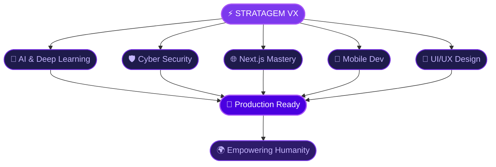

<!-- 
    ███████╗████████╗██████╗  █████╗ ████████╗ █████╗  ██████╗ ███████╗███╗   ███╗    ██╗   ██╗██╗  ██╗
    ██╔════╝╚══██╔══╝██╔══██╗██╔══██╗╚══██╔══╝██╔══██╗██╔════╝ ██╔════╝████╗ ████║    ██║   ██║╚██╗██╔╝
    ███████╗   ██║   ██████╔╝███████║   ██║   ███████║██║  ███╗█████╗  ██╔████╔██║    ██║   ██║ ╚███╔╝ 
    ╚════██║   ██║   ██╔══██╗██╔══██║   ██║   ██╔══██║██║   ██║██╔══╝  ██║╚██╔╝██║    ╚██╗ ██╔╝ ██╔██╗ 
    ███████║   ██║   ██║  ██║██║  ██║   ██║   ██║  ██║╚██████╔╝███████╗██║ ╚═╝ ██║     ╚████╔╝ ██╔╝ ██╗
    ╚══════╝   ╚═╝   ╚═╝  ╚═╝╚═╝  ╚═╝   ╚═╝   ╚═╝  ╚═╝ ╚═════╝ ╚══════╝╚═╝     ╚═╝      ╚═══╝  ╚═╝  ╚═╝
-->

<div align="center">


<br/>

[](https://linkedin.com/in/chethan-kumar-b-s-781a002bb)
[](mailto:chethan.athulith@outlook.com)
[](https://github.com/StratagemVX)


</div>

---

<div align="center">

## ⚡ `SYSTEM.INITIALIZE()` ⚡

</div>

```javascript
const StratagemVX = {
    name: "Chethan Kumar B S",
    role: "Architect of Intelligent & Secure Systems",
    
    code: ["Python", "JavaScript", "TypeScript", "C++"],
    
    architecture: {
        frontend:  ["React", "Next.js", "Tailwind CSS"],
        backend:   ["Node.js", "Express.js", "REST APIs"],
        databases: ["MySQL", "MongoDB", "Redis"],
        ai_ml:     ["TensorFlow", "PyTorch", "Scikit-Learn", "OpenCV"],
        security:  ["Penetration Testing", "Cryptography", "Zero Trust"]
    },
    
    currentFocus: "Building AI-powered security systems",
    philosophy: "Security First. Intelligence Always.",
    
    coffee_to_code_ratio: "∞"
};
```

---

<div align="center">

## 🎯 WHAT I DO

<table>
<tr>
<td width="50%">

### 🛡️ Cyber Security
```yaml
Focus:
  - Penetration Testing
  - Vulnerability Assessment
  - Security Architecture
  - Zero Trust Implementation
  
Philosophy: "Break it to make it stronger"
```

</td>
<td width="50%">

### 🤖 AI Engineering
```yaml
Focus:
  - Neural Network Design
  - ML Model Deployment
  - Computer Vision
  - NLP Systems
  
Philosophy: "Teach machines to think"
```

</td>
</tr>
<tr>
<td width="50%">

### 🌐 Full Stack Development
```yaml
Focus:
  - Scalable APIs
  - Microservices
  - Real-time Systems
  - Cloud Architecture
  
Philosophy: "Build for tomorrow"
```

</td>
<td width="50%">

### 🗄️ Database Engineering
```yaml
Focus:
  - Query Optimization
  - Schema Design
  - Data Security
  - Performance Tuning
  
Philosophy: "Data is the new gold"
```

</td>
</tr>
</table>

</div>

---

<div align="center">

## 🗺️ CURRENT MISSION MAP



</div>

---

<div align="center">

## 🔮 TECH ARSENAL


</div>

<br/>

<div align="center">

| 💻 Languages | 🎨 Frontend | ⚙️ Backend | 🗃️ Database | 🧠 AI/ML |
|:---:|:---:|:---:|:---:|:---:|
|  |  |  |  |  |
|  |  |  |  |  |
|  |  |  |  |  |
|  |  |  |  |  |

</div>

---

<div align="center">

## 📊 GITHUB ANALYTICS


</div>

---

<div align="center">

## 🐍 CONTRIBUTION SNAKE

<picture>
  <source media="(prefers-color-scheme: dark)" srcset="https://raw.githubusercontent.com/StratagemVX/StratagemVX/output/github-contribution-grid-snake-dark.svg" />
  <source media="(prefers-color-scheme: light)" srcset="https://raw.githubusercontent.com/StratagemVX/StratagemVX/output/github-contribution-grid-snake.svg" />
  
</picture>

</div>

---

<div align="center">

## 🎭 BEYOND THE CODE

</div>

<table align="center">
<tr>
<td align="center" width="25%">
<br/>

<br/><sub><i>Understanding the criminal mind</i></sub>
<br/><br/>
</td>
<td align="center" width="25%">
<br/>

<br/><sub><i>Coding in the zone</i></sub>
<br/><br/>
</td>
<td align="center" width="25%">
<br/>

<br/><sub><i>Protecting the digital realm</i></sub>
<br/><br/>
</td>
<td align="center" width="25%">
<br/>

<br/><sub><i>Pattern recognition IRL</i></sub>
<br/><br/>
</td>
</tr>
</table>

---

<div align="center">

## 💭 PHILOSOPHY


</div>

---

<div align="center">

## 🌐 CURRENT STATUS

```
┌──────────────────────────────────────────────────────────────────┐
│                                                                  │
│   ███████╗████████╗ █████╗ ████████╗██╗   ██╗███████╗            │
│   ██╔════╝╚══██╔══╝██╔══██╗╚══██╔══╝██║   ██║██╔════╝            │
│   ███████╗   ██║   ███████║   ██║   ██║   ██║███████╗            │
│   ╚════██║   ██║   ██╔══██║   ██║   ██║   ██║╚════██║            │
│   ███████║   ██║   ██║  ██║   ██║   ╚██████╔╝███████║            │
│   ╚══════╝   ╚═╝   ╚═╝  ╚═╝   ╚═╝    ╚═════╝ ╚══════╝            │
│                                                                  │
│   🟢 AI Modules.............. ACTIVE                             │
│   🟢 Security Protocols...... ENABLED                            │
│   🟢 Neural Networks......... LEARNING                           │
│   🟢 Backend Systems......... ONLINE                             │
│   🟢 Database Connections.... SECURE                             │
│                                                                  │
│   > Mission: Empowering Humanity Through Technology              │
│                                                                  │
└──────────────────────────────────────────────────────────────────┘
```

</div>

---

<div align="center">

## 🤝 LET'S CONNECT

<br/>

<a href="https://linkedin.com/in/chethan-kumar-b-s-781a002bb">
  
</a>
&nbsp;
<a href="mailto:chethan.athulith@outlook.com">
  
</a>
&nbsp;
<a href="https://github.com/StratagemVX">
  
</a>

<br/><br/>

[](https://github.com/StratagemVX)

</div>

---

<div align="center">


</div>

<!-- 
    Thank you for visiting my profile!
    Feel free to fork this README for your own use.
    
    "The best security is the one that's never tested."
    - But always test your security 😉
-->
